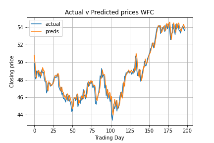
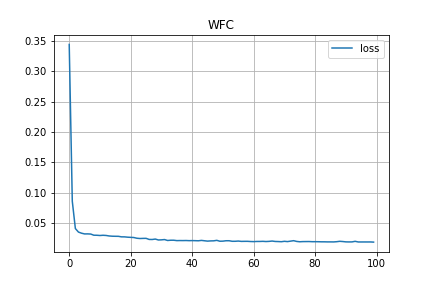
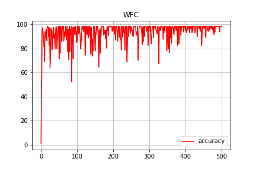

# MSc Computational Finance module CF981: CCFEA MSc Dissertation

_A work-in-progress_

## Forecasting daily Closing Prices of Equity symbols using ANNs

The project implements a Recurrent Neural Network (RNN) in the form of two Long Short-Term Memory (LSTM) layers to attempt to predict future closing prices for stocks.

### Data
Data is pulled via the [tiingo API](https://api.tiingo.com/), which includes daily values for open, high, low, close and trading volume of a wide variety of symbols. We chose symbols listed under the New York Stock Exchange.

### Methodology, so far...
Predictions are made using raw data, even though we computed other composite metrics like Stochastic Oscillator indices, weighted averages, Bollinger bands. More work is needed to incorporate those metrics in the network which will hopefully result in more accurate predictions. The 3 features in the data are `open`, `high` and `low` values which are used to attempt to predict how the `close` price will look like at the end of the trading day. The data aren't scaled, though future work will probably involve a scaling transformation.

Our model currently is a sequential single layer LSTM RNN + Dense, though future work will add one more LSTM layer. 100 LSTM nodes are currently used. [Rectified Linear Units (ReLU)](https://keras.io/api/layers/activations/) are used as activation functions and [Adam](https://arxiv.org/abs/1412.6980) as the optimiser.

```
model = Sequential()
model.add(LSTM(100, activation="relu", return_sequences=True, input_shape=(n_steps, n_features)))
model.add(LSTM(100, activation="relu"))
model.add(Dense(n_features))
opt = Adam(learning_rate=0.001)
model.compile(optimizer=opt, loss="mae", metrics=["accuracy"])
```

### Results, so far...




Trying to fit the model onto the testing data seems to work, not as accurate as I would like it to be.
Reported loss and accuracy for WFC dataset: 
```
History Item [loss] reports value of 0.19859882831573486
History Item [accuracy] reports value of 0.9599999785423279
```

Accuracy has increased dramatically since last tinkering. Will further tinker with learning rate, loss function, activation function, node count, etc.

 

### Tech used
The usual python data stack is used in this project:
* pandas
* numpy
* sklearn
* statsmodels

For deep learning we are using:
* Keras
* TensorFlow


